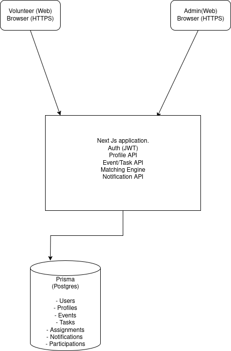

# Assignment 1

## Matteo Ramazzini

Problem Statement

A non-profit organization has requested to build a software application that will help manage and optimize their volunteer activities. The application should help the organization efficiently allocate volunteers to different events and tasks based on their preferences, skills, and availability. The application should consider the following criteria:

    Volunteer’s location
    Volunteer’s skills and preferences
    Volunteer’s availability
    Event requirements and location
    Task urgency and priority

The software must include the following components:

    Login (Allow volunteers and administrators to register if not already registered)
    User Registration (Initially only username and password, followed by email verification)
    User Profile Management (After registration, users should log in to complete their profile, including location, skills, preferences, and availability)
    Event Management (Administrators can create and manage events, specifying required skills, location, and urgency)
    Volunteer Matching (A module that matches volunteers to events/tasks based on their profiles and the event requirements)
    Notification System (Send notifications to volunteers for event assignments, updates, and reminders)
    Volunteer History (Track volunteer participation history and performance)

Answer these questions:

## Initial Thoughts (2 points)

Discuss your initial thoughts in detail on how you will design this application.

For user experience, I want a simple UI that is easy to navigate. The main dashboard will have clear sections for volunteers and administrators. Volunteers can easily view available events, update their profiles, and see their volunteer history. Administrators will have access to event management tools and volunteer matching features. I will use a responsive design to ensure the application works well on both desktop and mobile devices.

The essential features are login, registration, profile management, event management, volunteer matching, notification system, and volunteer history.

For the technology stack, I would use Next.js for the backend and frontend. Next.js has built in api routes that make it easy to build a backend. It also has good support for server side rendering, which is good for SEO. I can use JWT for authentication, and prisma for database ORM. For the database, I would use PostgreSQL. For the frontend, I would use React with TailwindCSS and DaisyUI for styling.

## Development Methodology (2 points)

Discuss which development methodology you will use and why.

I am working alone and am going to finish this in an afternoon. So I don't need any particular development methodology. I will just work on it in a linear fashion, starting with the backend and then moving to the frontend. If this were a larger project where I worked with others, probably agile development would be best, because its the one I am most familiar with from other projects.

Discuss how this methodology will help manage the project effectively.

It is a small project. It will be easy to manage without any particular methodology.

## High-Level Design / Architecture (6 points)

Provide a high-level design or architecture of the solution you are proposing.

**Main Components**

- Frontend: React (Next.js) with TailwindCSS and DaisyUI
- Backend: Next.js API routes
- Database: PostgreSQL with Prisma ORM
- Authentication: JWT-based
- Notifications: Email system via Nodemailer

**Architecture**

1. **Frontend (Next.js + React)**:

   - Login and registration pages
   - Volunteer dashboard (events, history, profile management)
   - Admin dashboard (event creation, volunteer matching)

2. **Backend (API routes in Next.js)**:

   - Authentication routes (login, register, email verification)
   - Profile routes (CRUD for user info, availability, skills)
   - Event routes (CRUD for events, requirements, urgency)
   - Matching engine (algorithm to match volunteers to tasks)
   - Notification routes (trigger email notifications)

3. **Database (PostgreSQL + Prisma)**:
   - User table (username, password, email, role, location)
   - Profile table (skills, preferences, availability)
   - Event table (requirements, location, urgency)
   - Volunteer history table (assignments, participation)

**Third-Party Services**

- Email notifications with Nodemailer or Sendgrid. I think Sendgrid charges so probably nodemailer.
