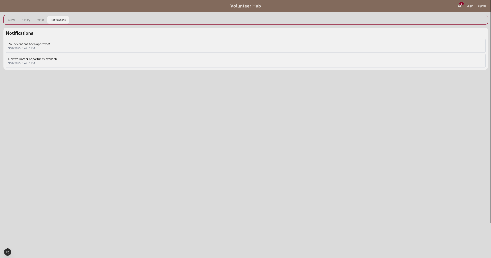

# Assignment 2

## Matteo Ramazzini

## Github Link

[Click Here](https://github.com/mramazzini/COSC-4354-project)

## Design and Development Methodology

> Did not change

## Front End technologies

- React: Useful for building user interfaces with reusable components.
- Next.js: Provides server-side rendering and static site generation.
- TailwindCSS and DaisyUI: Very easy to throw UIs together.
- RTK Query: Simplifies data fetching and state management in React applications.
- Formik: React library for building and managing forms.
- Manually validating fields for now, plan on using Yup library to streamline form validation.

## Screenshots

1. Login Page

2. User Registration

3. Profile Management

4. Event Management

5. Volunteer Matching

6. Notification System

7. Volunteer History

